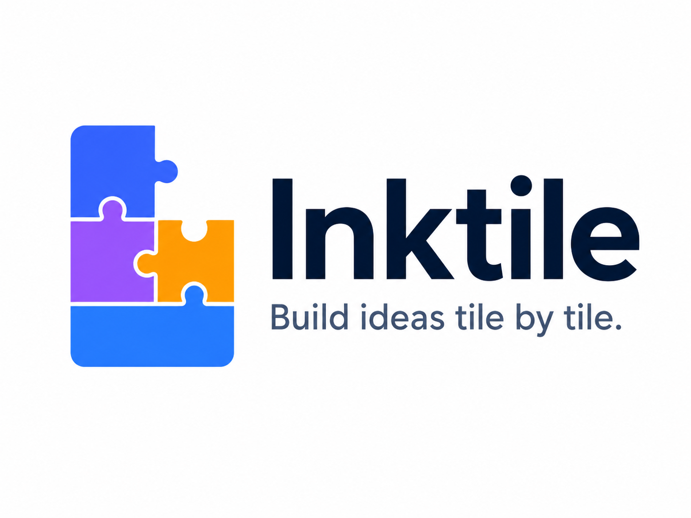
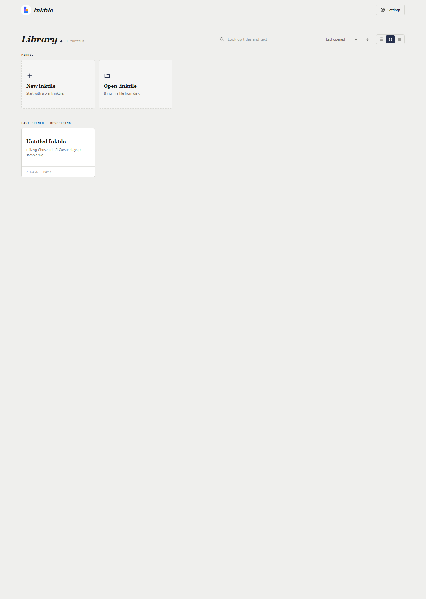

<div align="center">
  

  Notes, drafts, references, and media in flexible documents that stay on your machine.

  <p>
    <a href="https://github.com/maxlbchung/inktile"></a>
    <a href="https://github.com/maxlbchung/inktile/commits/main"></a>
    
    
    
  </p>

  <p>
    <a href="#quick-start">Get started</a> ·
    <a href="#what-makes-inktile-different">Why Inktile</a> ·
    <a href="#commands">Commands</a>
  </p>
</div>

<br>

<div align="center">
  
</div>

## The short version

Inktile is a local-first knowledge store and writing workspace. Use it for meeting notes, research, project thinking, personal records, rough drafts, or anything you would normally scatter across Google Docs, Word, notes apps, and folders.

It gives those things one durable home: searchable inktiles made from text, versions, drawings, images, video, and audio. An inktile can be tidy like a finished document or loose like a desk covered in working notes.

Your documents and media stay on your machine. Browser development uses IndexedDB and file pickers; the shipped Windows app uses the native filesystem through Tauri.

## What makes Inktile different

| 01 · Remember more | 02 · Write your way | 03 · Keep ownership |
| --- | --- | --- |
| Searchable inktiles for notes, drafts, references, and media. | One page, one component — text, versions, drawings, or media. | Local files, local media, local recovery autosaves. |

### A knowledge store with room to breathe

Inktile keeps the familiarity of a document editor while making room for more than a single linear page. Rows can hold up to four pages, pages can sit beside one another, and different kinds of material can live together in the same inktile. The result is a personal reference space, not just another blank page.

### For the work between documents

Start with an empty inktile. Capture a thought as text, keep competing drafts in a version page, sketch an idea, or save supporting media beside the words. Inktile is for the notes before the report, the research around the proposal, and the context that usually gets lost between documents.

## Features

- **Notes and writing** with rich text, emphasis, underline, strikethrough, alignment, and vertical anchoring
- **Version pages** for comparing drafts, tracking progress, and converting a version to plain text
- **Vector drawing** with pen, highlighter, eraser, undo, clear, and theme-reactive colors
- **Media pages** that detect supported image, video, and audio files in one action
- **Page composition** with pointer-based ordering, side-by-side grouping, and shared row resizing
- **A personal knowledge library** for creating, importing, reopening, renaming, pinning, duplicating, deleting, sorting, and searching inktiles
- **Inkjet, the built-in AI agent** (desktop app): open the panel and it auto-detects the providers signed in on your machine (Claude Code, Codex) — pick one, pick a model, start a session. Zero extra setup. It writes into the open inktile live, researches on the web, and a whole turn reverts with one Ctrl+Z — see the Inkjet section in [Architecture](docs/ARCHITECTURE.md)
- **Portable `.inktile` archives** with a manifest and separate binary assets
- **Export** from the toolbar as an `.inktile` archive, a PDF through the system print dialog, or a plain-text `.txt` that keeps every tile's text, all versions, and notes
- **Browser and Windows desktop modes** backed by the same React editor

## Quick start

### Browser development

Requirements: Node.js with npm.

```bash
npm install
npm run dev
```

Vite prints the local development URL in the terminal.

### Windows desktop development

Install the [Tauri 2 prerequisites](https://v2.tauri.app/start/prerequisites/) and Rust, then run:

```bash
npm install
npm run tauri dev
```

## Commands

| Command | What it does |
| --- | --- |
| `npm run dev` | Start the Vite development server |
| `npm run build` | Type-check and build the production web bundle |
| `npm run check` | Run docs, build, archive, broker typecheck, and UI syntax checks |
| `npm run test:archive` | Exercise `.inktile` encode/decode with an asset |
| `npm run test:ui` | Run the Chromium interaction smoke suite |
| `npm test` | Run build, archive, and live UI smoke coverage |
| `npm run tauri dev` | Launch the native desktop shell |
| `npm run check:agent` | Typecheck the zero-dependency Inkjet broker |
| `npm run release:desktop` | Validate and build Windows release bundles |

The UI smoke suite needs Chromium. Set `CHROMIUM_PATH` when it is not available at the script's default location. The full validation matrix lives in [Testing and release](docs/TESTING_AND_RELEASE.md).

## Under the hood

```text
                    Toolbar · PageStack · PageView
                                  │
                         DocumentContext
                         ╱             ╲
                 document state     runtime assets
                         ╲             ╱
                    archive + file system
                    browser or Tauri shell
```

`DocumentContext` is the mutation boundary for document structure. `pageRows` is the canonical visual arrangement, while `pageOrder` is its flattened index. Media bytes live in a runtime asset map and are written beside `manifest.json` inside the `.inktile` ZIP container.

| Area | Responsibility |
| --- | --- |
| `src/components/` | Editor UI and page renderers |
| `src/document/` | Persisted types, factories, normalization, and mutations |
| `src/persistence/` | ZIP archive, native/browser file IO, export, and recovery autosave |
| `agent/` | Zero-dependency Inkjet broker that drives the Claude Code and Codex CLIs |
| `src-tauri/` | Native shell, permissions, icons, and bundling |
| `scripts/` | Smoke tests, docs checks, hooks, and release automation |

## `.inktile` files

Inktile documents are ZIP containers designed to stay legible and portable:

```text
manifest.json
README.txt
assets/<uuid>.<extension>
```

Documents are intentionally local-first. Cloud synchronization and collaboration are outside the current product boundary.

## Project notes

Inktile is an evolving desktop editor, not a finished productivity suite. The interaction and layout contracts are documented in [Product invariants](docs/PRODUCT_INVARIANTS.md). Read [Architecture](docs/ARCHITECTURE.md) before changing state flow, page layout, dragging, persistence, or drawing behavior.

## License

No license has been selected for this repository yet.

<br>

<div align="center">
  <sub>Made for the moment before the idea knows what it is.</sub>
</div>
