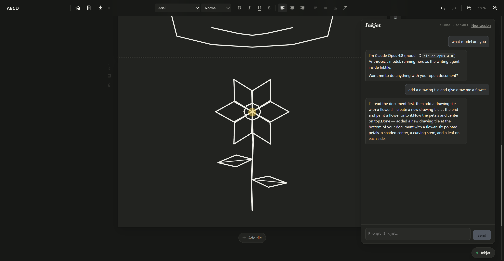

<div align="center">
  

  A modular document editor where text, drafts, drawings, and media live together as cells — and stay on your machine.

  <p>
    <a href="https://github.com/maxlbchung/inktile"></a>
    <a href="https://github.com/maxlbchung/inktile/commits/main"></a>
    
    
    
  </p>

  <p>
    <a href="#quick-start">Get started</a> ·
    <a href="#elevator-pitch">Why Inktile</a> ·
    <a href="#inkjet-the-agent-runner">Inkjet</a> ·
    <a href="#commands">Commands</a>
  </p>
</div>

<br>

<div align="center">
  
</div>

## Elevator Pitch

Inktile is a modular document editor, where you arrange cells with various content types. It functions as a freeform document canvas enabling more creative layouts and designs, while still retaining the classic document shape for more traditional document work.

Inkjet is Inktile's built-in meta harness: it unifies your installed coding CLIs under one protocol and gives each its own system prompt, tool surface, sandbox, and effect-mediation. It lets those agents write, draw on, and arrange tiles in your projects with no setup necessary.

## Features

- **A grid document canvas** — a document is rows of up to four cells side by side, each cell holding one thing (text, a version set, a drawing, or media), so different kinds of material live together in one inktile
- **Notes and writing** with rich text, emphasis, underline, strikethrough, alignment, and vertical anchoring — plus checklists, tables, LaTeX math (KaTeX), and markdown-style shortcuts (`- `, `1. `, `[] `, `# `, `---`)
- **Version pages** for comparing drafts, tracking progress, and converting a version to plain text
- **Vector drawing** with pen, highlighter, eraser, undo, clear, and theme-reactive colors
- **Media pages** that detect supported image, video, and audio files in one action
- **Freeform layout** with pointer-based ordering, side-by-side grouping, shared row resizing, and column width splits
- **A personal library** for creating, importing, reopening, renaming, pinning, duplicating, deleting, sorting, and searching inktiles
- **Inkjet owns your CLI** (desktop app) — it detects the coding-agent CLIs already installed and signed in (Claude Code, Codex, OpenCode), spawns them headless, supervises each turn, and sandboxes them to web research and this one document: zero setup, no API keys, no ports, no MCP wiring
- **Inkjet edits the open document live** — text streams in as it's written; it creates, arranges, and deletes tiles, keeps notes on tile backs, and draws stroke by stroke; and the whole turn reverts with a single Ctrl+Z — [how it works](#inkjet-the-agent-runner)
- **Portable `.inktile` archives** with a manifest and separate binary assets
- **Export** from the toolbar as an `.inktile` archive, a PDF through the system print dialog, or a plain-text `.txt` that keeps every tile's text, all versions, and notes
- **Browser and Windows desktop modes** backed by the same React editor

## Inkjet, the agent-runner

Inkjet is the agent-runner that lives inside the desktop app — it's the panel drawing the flower in the screenshot above. Open it and Inktile detects the AI CLIs already installed and signed in on your machine (Claude Code, Codex, OpenCode). No API keys, no accounts, no configuration: pick a provider, pick a model, start a session, and ask for what you want.

**It edits the document you're looking at.** Inkjet has full control of the open inktile: it writes and edits text in small chunks that render as they arrive, creates, arranges, and deletes tiles, keeps notes on tile backs, manages version pages, authors drawings stroke by stroke, and adds SVG illustrations or media found while researching on the web.

**You stay in charge.**

- While a turn runs, the workspace locks read-only with an "Inkjet is printing" indicator and a Stop button.
- The model's reasoning and working notes stream into a temporary "thinking" bubble; only its final answer lands in the transcript.
- An entire turn — however many edits it made — reverts with a single Ctrl+Z. Stop keeps what's already written, still as one undo step.

**It's local and contained.** The panel talks to a small dependency-free broker the app spawns on demand; the broker drives your own CLI on your existing login and never touches your files. Every change flows through the app's own document mutations, so layout rules, autosave, and history behave exactly as if you had made the edit yourself — and a revision guard forces the agent to re-read whenever you've edited the document since its last look. The providers run with web research only: no shell, no filesystem.

The full mechanics — broker, wire protocol, turn lock, revision guard — are documented in [Architecture](docs/ARCHITECTURE.md).

## Quick start

### Browser development

Requirements: Node.js with npm.

```bash
npm install
npm run dev
```

Vite prints the local development URL in the terminal.

### Windows desktop development

Install the [Tauri 2 prerequisites](https://v2.tauri.app/start/prerequisites/) and Rust, then run:

```bash
npm install
npm run tauri dev
```

## Commands

| Command | What it does |
| --- | --- |
| `npm run dev` | Start the Vite development server |
| `npm run build` | Type-check and build the production web bundle |
| `npm run check` | Run docs, build, archive, broker typecheck, and UI syntax checks |
| `npm run test:archive` | Exercise `.inktile` encode/decode with an asset |
| `npm run test:ui` | Run the Chromium interaction smoke suite |
| `npm test` | Run build, archive, and live UI smoke coverage |
| `npm run tauri dev` | Launch the native desktop shell |
| `npm run check:agent` | Typecheck the zero-dependency Inkjet broker |
| `npm run release:desktop` | Validate and build Windows release bundles |

The UI smoke suite needs Chromium. Set `CHROMIUM_PATH` when it is not available at the script's default location. The full validation matrix lives in [Testing and release](docs/TESTING_AND_RELEASE.md).

## Under the hood

```text
                    Toolbar · PageStack · PageView
                                  │
                         DocumentContext
                         ╱             ╲
                 document state     runtime assets
                         ╲             ╱
                    archive + file system
                    browser or Tauri shell
```

`DocumentContext` is the mutation boundary for document structure. `pageRows` is the canonical visual arrangement, while `pageOrder` is its flattened index. Media bytes live in a runtime asset map and are written beside `manifest.json` inside the `.inktile` ZIP container.

| Area | Responsibility |
| --- | --- |
| `src/components/` | Editor UI and page renderers |
| `src/document/` | Persisted types, factories, normalization, and mutations |
| `src/persistence/` | ZIP archive, native/browser file IO, export, and recovery autosave |
| `agent/` | Zero-dependency Inkjet broker that drives the Claude Code, Codex, and OpenCode CLIs |
| `src-tauri/` | Native shell, permissions, icons, and bundling |
| `scripts/` | Smoke tests, docs checks, hooks, and release automation |

## `.inktile` files

Inktile documents are ZIP containers designed to stay legible and portable:

```text
manifest.json
README.txt
assets/<uuid>.<extension>
```

Documents are intentionally local-first. Cloud synchronization and collaboration are outside the current product boundary.

## Project notes

Inktile is an evolving desktop editor, not a finished productivity suite. The interaction and layout contracts are documented in [Product invariants](docs/PRODUCT_INVARIANTS.md). Read [Architecture](docs/ARCHITECTURE.md) before changing state flow, page layout, dragging, persistence, or drawing behavior.

<br>

<div align="center">
  <sub>Made for the moment before the idea knows what it is.</sub>
</div>
