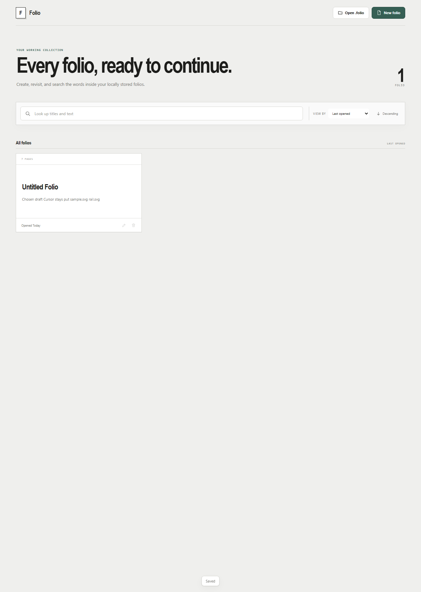

<div align="center">
  

  # Folio

  ### A quiet place for ideas that need room to become something.

  Local-first documents for text, versions, drawings, images, video, and audio — arranged exactly how you want them.

  <p>
    <a href="https://github.com/maxlbchung/folio"></a>
    <a href="https://github.com/maxlbchung/folio/commits/main"></a>
    
    
    
  </p>

  <p>
    <a href="#quick-start">Get started</a> ·
    <a href="#what-makes-folio-different">Why Folio</a> ·
    <a href="#commands">Commands</a>
  </p>
</div>

<br>

<div align="center">
  
</div>

## The short version

Folio is a small, local-first document editor. It treats a document like a set of pages on a desk: place pages side by side, resize them together, flip between front and back faces, and keep different kinds of work in one cohesive space.

Your documents and media stay on your machine. Browser development uses IndexedDB and file pickers; the shipped Windows app uses the native filesystem through Tauri.

## What makes Folio different

| 01 · Keep it yours | 02 · Compose freely | 03 · Stay in the flow |
| --- | --- | --- |
| Local documents, local media, local recovery autosaves. | One page, one component — text, versions, drawings, or media. | Search, zoom, themes, fullscreen, undo/redo, and compact controls. |

### A document is a canvas, not a form

Every page owns exactly one component. Rows can hold up to four pages, grouped pages share a bottom edge, and the whole composition keeps a constant document width. The result is closer to arranging index cards than filling out a sidebar-heavy editor.

### Built for unfinished work

Start with an empty folio. Keep a thought as text, put competing drafts into a version page, sketch over a drawing surface, or drop in media when words are not enough. Folio is deliberately comfortable before the work has a name.

## Features

- **Rich text pages** with emphasis, underline, strikethrough, alignment, and vertical anchoring
- **Version pages** for comparing drafts, tracking progress, and converting a version to plain text
- **Vector drawing** with pen, highlighter, eraser, undo, clear, and theme-reactive colors
- **Media pages** that detect supported image, video, and audio files in one action
- **Page composition** with pointer-based ordering, side-by-side grouping, and shared row resizing
- **A local library** for creating, importing, reopening, renaming, deleting, sorting, and searching folios
- **Portable `.folio` archives** with a manifest and separate binary assets
- **Browser and Windows desktop modes** backed by the same React editor

## Quick start

### Browser development

Requirements: Node.js with npm.

```bash
npm install
npm run dev
```

Vite prints the local development URL in the terminal.

### Windows desktop development

Install the [Tauri 2 prerequisites](https://v2.tauri.app/start/prerequisites/) and Rust, then run:

```bash
npm install
npm run tauri dev
```

## Commands

| Command | What it does |
| --- | --- |
| `npm run dev` | Start the Vite development server |
| `npm run build` | Type-check and build the production web bundle |
| `npm run check` | Run docs, build, archive, and UI syntax checks |
| `npm run test:archive` | Exercise `.folio` encode/decode with an asset |
| `npm run test:ui` | Run the Chromium interaction smoke suite |
| `npm test` | Run build, archive, and live UI smoke coverage |
| `npm run tauri dev` | Launch the native desktop shell |
| `npm run release:desktop` | Validate and build Windows release bundles |

The UI smoke suite needs Chromium. Set `CHROMIUM_PATH` when it is not available at the script's default location. The full validation matrix lives in [Testing and release](docs/TESTING_AND_RELEASE.md).

## Under the hood

```text
                    Toolbar · PageStack · PageView
                                  │
                         DocumentContext
                         ╱             ╲
                 document state     runtime assets
                         ╲             ╱
                    archive + file system
                    browser or Tauri shell
```

`DocumentContext` is the mutation boundary for document structure. `pageRows` is the canonical visual arrangement, while `pageOrder` is its flattened index. Media bytes live in a runtime asset map and are written beside `manifest.json` inside the `.folio` ZIP container.

| Area | Responsibility |
| --- | --- |
| `src/components/` | Editor UI and page renderers |
| `src/document/` | Persisted types, factories, normalization, and mutations |
| `src/persistence/` | ZIP archive, native/browser file IO, and recovery autosave |
| `src-tauri/` | Native shell, permissions, icons, and bundling |
| `scripts/` | Smoke tests, docs checks, hooks, and release automation |

## `.folio` files

Folio documents are ZIP containers designed to stay legible and portable:

```text
manifest.json
README.txt
assets/<uuid>.<extension>
```

Documents are intentionally local-first. Cloud synchronization, collaboration, PDF export, and print layout are outside the current product boundary.

## Project notes

Folio is an evolving desktop editor, not a finished productivity suite. The interaction and layout contracts are documented in [Product invariants](docs/PRODUCT_INVARIANTS.md). Read [Architecture](docs/ARCHITECTURE.md) before changing state flow, page layout, dragging, persistence, or drawing behavior.

## License

No license has been selected for this repository yet.

<br>

<div align="center">
  <sub>Made for the moment before the idea knows what it is.</sub>
</div>
